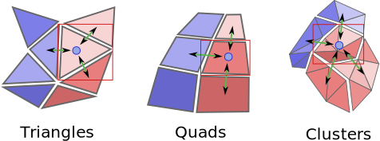
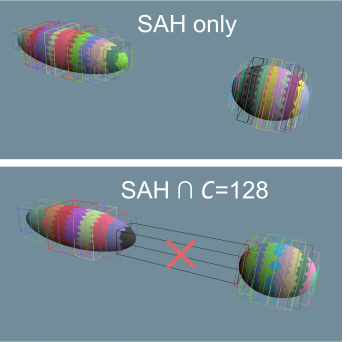
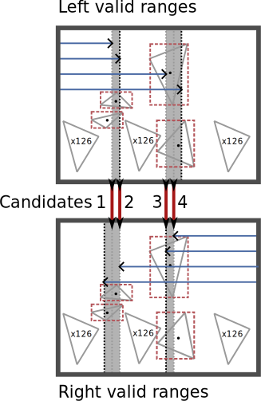

# nv_cluster_builder

**nv_cluster_builder** is a small generic spatial clustering C++ library, created
to cluster triangle meshes for ray tracing. It is less than 2k lines of code and
very similar to a recursive node splitting algorithm to create a bounding volume
hierarchy (BVH). It is limited to axis aligned splits but also produces clusters
with desirable attributes for raytracing.



**Input**

- Spatial locality
  - ${\color{red}\text{Bounding\ boxes}}$
  - ${\color{blue}\text{Centroids}}$
- ${\color{green}\text{Connectivity}}$ (Optional)
  - Adjacency lists
  - Weights


**Output**

Cluster items (membership)
- Ranges: \{ \{ ${\color{blue}0,4}$ \} , \{ ${\color{red}4,4}$ \} \}
- Items: \{
    ${\color{blue}3}$, ${\color{blue}4}$, ${\color{blue}6}$, ${\color{blue}1}$,
    ${\color{red}2}$, ${\color{red}7}$, ${\color{red}0}$, ${\color{red}1}$
    \}


**Notable features:**

- Primarily spatial, making clusters from bounding boxes
- Optional user-defined weighted adjacency
- Generic, not just triangles
- Customizable [min–max] cluster sizes
- Parallel, using std::execution
- Segmented API for clustering multiple subsets at once
- Knobs to balance optimizations

For a complete usage example, see https://github.com/nvpro-samples/vk_animated_clusters.

## Usage Example

For more details, refer to [`nvcluster.h`](include/nvcluster/nvcluster.h) (and optionally [`nvcluster_storage.hpp`](include/nvcluster/nvcluster_storage.hpp)).

```

...

// Create bounding boxes for each item to be clustered
std::vector<nvcluster::AABB> boundingBoxes{
    nvcluster::AABB{{0, 0, 0}, {1, 1, 1}}, // for example
    ...
};

// Generate centroids
std::vector<glm::vec3> centroids(boundingBoxes.size());
for(size_t i = 0; i < boundingBoxes.size(); i++)
{
  centroids[i] = 0.5f * (glm::vec3(boundingBoxes[i].bboxMin) + glm::vec3(boundingBoxes[i].bboxMax));
}

// Input structs
nvcluster::SpatialElements spatialElements{.boundingBoxes = boundingBoxes.data(),
                                           .centroids     = reinterpret_cast<const float*>(centroids.data()),
                                           .elementCount  = static_cast<uint32_t>(boundingBoxes.size())};
nvcluster::Input           input{
    .config =
        {
            .minClusterSize    = 128,
            .maxClusterSize    = 128,
            .costUnderfill     = 0.0f,  // zero to one (exclusive)
            .costOverlap       = 0.0f,  // zero to one (exclusive)
            .preSplitThreshold = 0,     // median-split bigger nodes (0=disable)
        },
    .spatialElements = &spatialElements,
    .graph           = nullptr, // optional adjacency - see test_clusterizer.cpp for examples of this in use
};

// Create context
nvcluster::ContextCreateInfo info{};
nvcluster::Context context;
nvclusterCreateContext(&info, &context);

// Create clusters
// This is a thin wrapper with std::vector output storage for nvcluster::nvclusterCreate(...)
nvcluster::ClusterStorage clustering;
nvcluster::generateClusters(context, input, clustering);

// Do something with the result
for(size_t clusterIndex = 0; clusterIndex < clustering.clusterRanges.size(); ++clusterIndex)
{
  const nvcluster::Range& range = clustering.clusterRanges[clusterIndex];
  for(uint32_t clusterItemIndex = 0; clusterItemIndex < range.count; ++clusterItemIndex)
  {
    uint32_t clusterItem = clustering.clusterItems[range.offset + clusterItemIndex];
    ...
  }
}
```

## Build Integration

This library uses CMake and requires C++20. It is currently a static
library, designed with C compatibility in mind with data passed as a structure
of arrays and output allocated by the user. Integration has been verified by
directly including it with `add_subdirectory`:

```
add_subdirectory(nv_cluster_builder)
...
target_link_libraries(my_target PUBLIC nv_cluster_builder)
```

If there is interest, please reach out for CMake config files (for
`find_package()`) or any other features. GitHub issues are welcome.

### Dependencies

None.

If tests are enabled (set the CMake `BUILD_TESTING` variable to `ON`),
nv_cluster_builder will use [`FetchContent`](https://cmake.org/cmake/help/latest/module/FetchContent.html)
to download GoogleTest.

## How it works

Authors and contact:

- Pyarelal Knowles (pknowles 'at' nvidia.com), NVIDIA
- Karthik Vaidyanathan, NVIDIA

Cluster goals:

- Consistent size for batch processing
- Spatially adjacent
- Well connected
- Small bounding box (low SAH cost)
- Low overlap
- Useful for ray tracing

The algorithm is basic recursive bisection:

1. Sorts inputs by centroids on each axis
2. Initialize with a root node containing everything
3. Recursively split until the desired leaf size is reached
   - Compute candidate split costs for all positions in all axes
   - Split at the lowest cost, maintaining sorted centroids by partitioning
4. Leaves become clusters

Novel additions:

- Limit split candidates to guarantee fixed cluster sizes
- Optimize for full clusters
- Optimize for less bounding box overlap
- Optimize for minimum *ratio cut* cost if adjacency exists

The optimizations are implemented by converting and summing additional costs
with the surface area heuristic (SAH) cost and choosing a split position on any
axis with minimum cost.

### Fixed Size Clusters

Only split at $i \bmod C = 0$, with $i$ items to the left of a candidate split,
to make clusters of size $C$. There will be at most one undersized cluster. This
rule alone will largely break SAH, as shown for the clustering along just one
axis. In reality, split candidates would be chosen for any axis



Relax the fixed $C$ constraint to allow a range, $[C_A, C_B]$ where $(1 \le C_A
\le C_B)$. Only split if the target range cluster sizes could be formed on both
sides. For example, the figure below shows forming clusters of size 127 or 128
items. Choosing splits in grey regions will produce clusters in the left node
(top) and right node (bottom) of the desired size range. Limit split candidates
to the intersection of the grey regions. The equivalent conditions are described the equations below, where
$n$ is the number of items in the node being split.



$$𝑖 \bmod 𝐶_𝐴 \le (𝐶_𝐵 − 𝐶_𝐴) \lfloor \frac{𝑖}{𝐶_𝐴} \rfloor$$
$$(n - 𝑖) \bmod 𝐶_𝐴 \le (𝐶_𝐵 − 𝐶_𝐴) \lfloor \frac{n - 𝑖}{𝐶_𝐴} \rfloor$$

For small inputs it is possible that there is no overlap in valid ranges, in
which case the algorithm falls back to choosing just one. Similarly to the fixed
$C_A = C_B$ case, there will be at most one undersized cluster.

### Maximize Cluster Sizes

A cluster "underfill" cost is introdued to encourage bigger clusters. For
example, in the figure below a split position is being considered for clusters
in the range [1, 4]. The split candidate would produce a node of 2.75 clusters
on the left and 1.25 on the right. This results in $p$ missing cluster items.
This value is converted to SAH units and summed. This library currently uses a
linear cost with a tunable `costUnderfill` constant, but a transfer function to
model the true cost, of e.g. perf or memory, would be ideal.


$$p_{\text{left}} = C_B \lceil \frac{i}{C_B} \rceil - i$$
$$p_{\text{right}} = C_B \lceil \frac{n - i}{C_B} \rceil - (n - i)$$
$$p = C_B ( \lceil \frac{i}{C_B} \rceil + \lceil \frac{n - i}{C_B} \rceil ) - n$$

### Minimize Bounding Box Overlap

Bounding box overlap is bad for ray tracing because rays must enter both while
in the overlap volume. A cost is added for overlapping bounding boxes, ver much
like SAH it is just $n$ multiplied by the surface area of the bounding box
intersection's box and balanced with a tunable `costOverlap` constant.

### Minimize Adjacency Cut Cost

If provided, adjacency is integrated by adding the *cut cost* - the sum of
weights of all item connections broken by the split - to each candidate split
position. *Ratio cut* [Wei and Cheng, 1989] is used to avoid degenerate
solutions. The cut cost is arbitrarily scaled by the number of items in the node
to be SAH relative and added to the other costs above.

To compute the cut cost, the adjacency data is rebuilt to reference node items
before each iteration of recursive node splitting. This allows cut costs to be
computed with a prefix sum scan of summed starting and ending connection
weights.

To explain, there are initially three arrays, sorted by item centroids in *X*,
*Y* and *Z* respectively. After splitting, these arrays are partitioned,
maintaining sorted order within nodes. These hold original item indices and in
fact trivially hold the clustering result after splitting. The input adjacency
arrays index original items, but we instead need the index in those initially
sorted arrays. This is done by duplicating the adjacency arrays and scatter
writing their node-sorted indices. The image below shows this for one axis.


When computing cut costs for a node, an array of summed weights is created. The
image below shows an example with unit weights. The array is initialized with
the sum of connecting item weights - positive for connections to the right and
negative for connections to the left. Connections to other nodes are ignored.
The reindexed adjacency arrays trivially give this information, comparing the
connection index with the current item's index and the node boundaries. The
weights array is then prefix summed to obtain the cut cost for each position in
the node.


### Citation

The BibTex entry to cite `nv_cluster_builder` is

```bibtex
@online{nv_cluster_builder,
   title   = {{{NVIDIA}}\textregistered{} {nv_cluster_builder}},
   author  = {{NVIDIA}},
   year    = 2025,
   url     = {https://github.com/nvpro-samples/nv_cluster_builder},
   urldate = {2025-01-30},
}
```

## Limitations

Clusters are created by making recursive axis aligned splits. This is useful as
it greatly reduces the search space and improves performance when clusters are
used in ray tracing. However, more general clustering solutions than
axis aligned splits are not considered.

Recursively splitting is done greedily, picking the lowest cost split which may
not be a global optimum.

The algorithm is primarily spatial due to splitting in order of centroids, but
solutions can be skewed by adjusting the costs in `nvcluster::Config` and
adjacency weights in `nvcluster::Graph::connectionWeights`. For example, choosing
adjacency weights to represent connected triangles or number of shared vertices
can result in more vertex reuse within clusters. Weights may also represent face
normal similarity or a balance of multiple attributes.

Badly chosen weights can result in degenerate solutions where recursive
bisection splits off single leaves. This is both slow and rarely desirable.
